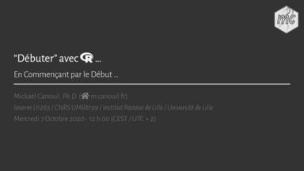

<!-- README.md is generated from README.Rmd. Please edit that file -->

# rstartup

<!-- badges: start -->

<!-- badges: end -->

This is the repository for the slides about how to have a good start
with R (in French).

